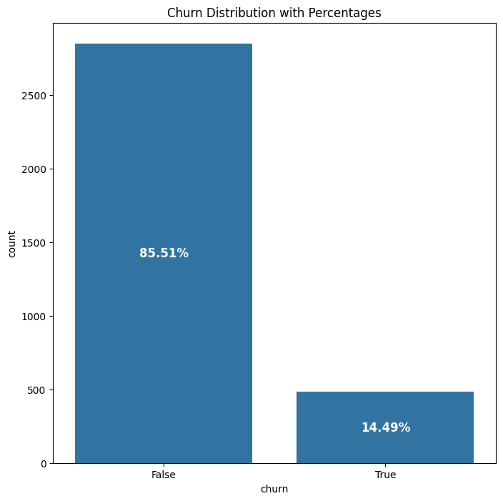
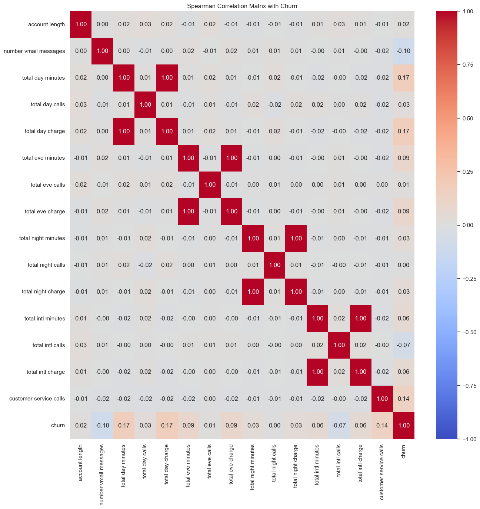
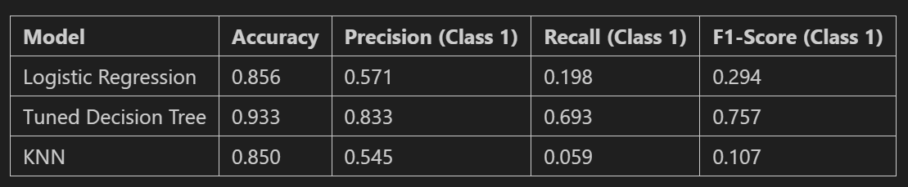
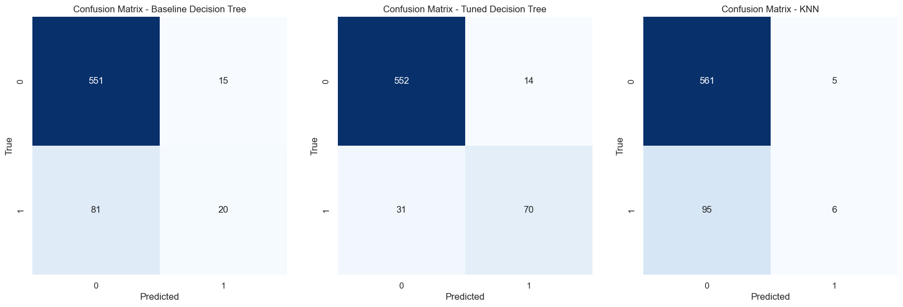
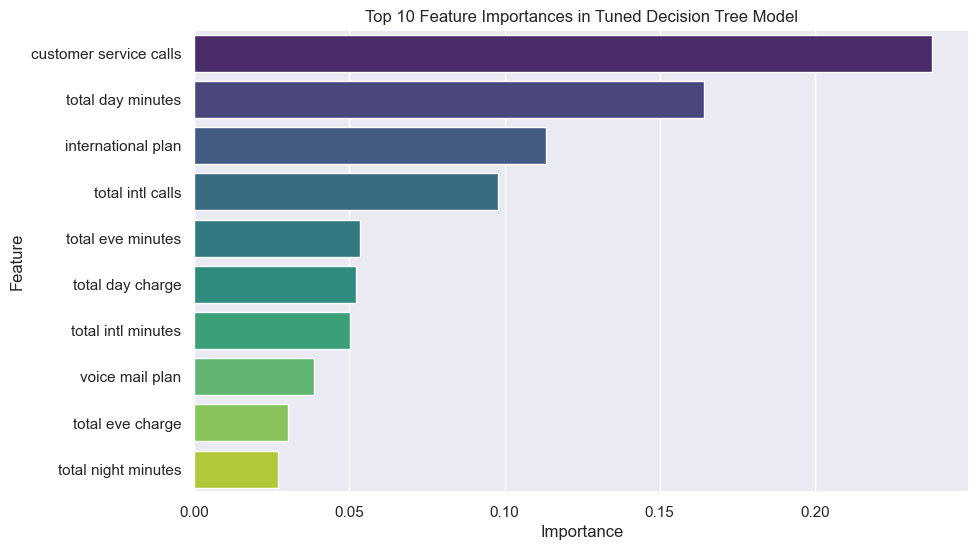

# SyriaTel Customer Churn

# Overview

SyriaTel, a leading telecommunications company, is facing challenges in retaining its customer base. Customer churn, the phenomenon where customers discontinue their services, is a significant concern as it not only impacts revenue but also affects the company's reputation in a competitive market. Identifying patterns and predicting customer churn can provide valuable insights to proactively address issues and implement strategies to retain customers.

# Problem Statement

The business problem at hand is to develop a predictive model that can accurately identify customers at risk of churning from SyriaTel's services. By leveraging historical customer data and relevant features, the goal is to create a classifier that can distinguish between customers likely to continue their services and those likely to churn in the near future.

Objectives:

* Prediction: Develop a robust binary classification model to predict customer churn accurately.
* Identify Key Factors: Identify and analyze the key features contributing to customer churn.
* Proactive Retention Strategies: Provide actionable insights to the business to implement targeted retention strategies for at-risk customers.
* Revenue Protection: Minimize revenue loss by reducing the number of customers who discontinue services.

***
# Data Understanding
***
Data imported from <a href="https://www.kaggle.com/datasets/becksddf/churn-in-telecoms-dataset/code">Kaggle</a>

# Looking at churn's distribution

This indicates that the dataset is imbalanced with a higher prevalence of non-churned instances - False of 85.51% and only 14.49% of class 1 - True.
 
 # Correlation heatmap
 

Models used are
1. `Logistic Regression`
2. `K-Nearest Neighbors`
3. `Hyperparameter Tuning using Gridsearch and Decision Trees`

 # Model Scores
 
 In summary, the tuned Decision Tree model stands out with significantly improved accuracy, precision, recall, and F1-score compared to Logistic Regression and KNN. Tuned Decision Tree is recommended for predicting customer churn in this scenario due to its balanced and improved performance across multiple metrics.

 # Confusion Matrices
 

 # Summary
 In terms of accuracy, precision, recall, and F1-score, the tuned Decision Tree outperforms the baseline model and the KNN model. The improvements are particularly notable in correctly identifying customers who are likely to churn.

 # Top 10 Feature importances based on Tuned Model
 

 1. Customer Service Calls (Importance: 23.79%)
 2. Total Day Minutes (Importance: 16.42%)
 3. International Plan (Importance: 11.34%)

 # Recommendations

# 1. Enhance Customer Service:

Invest in customer service training and resources to address concerns and inquiries promptly.
Implement proactive customer support measures to prevent issues before they escalate.

# 2. Personalized Plans and Offers:

Leverage customer usage data to create personalized plans and offers.
Provide targeted promotions and discounts based on individual customer preferences.

# 3. International Plan Optimization:

Analyze and optimize international plans to meet customer needs and expectations.
Consider bundling international plans with additional features to increase value.